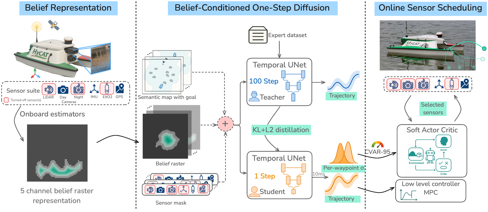

# B-COD: Belief-Conditioned One-Step Diffusion for Sensor Management


[](https://opensource.org/licenses/MIT)
[](https://github.com/bcod-diffusion/bcod)
[](https://github.com/bcod-diffusion/bcod)
[](https://google.github.io/styleguide/cppguide.html)
[](https://github.com/bcod-diffusion/bcod)

## Website: https://bcod-diffusion.github.io

This is the repository for the B-COD project. The code contains the real-time implementation of the B-COD (inference) pipeline.

Note: An extensive hardware documentation is available here: https://github.com/bcod-diffusion/searobotics_surveyor

## Overview
Robots equipped with rich sensor suites can localize reliably in partially-observable environments---but powering every sensor continuously is wasteful and often infeasible. Belief-space planners address this by propagating pose-belief covariance through analytic models and switching sensors heuristically--a brittle, runtime-expensive approach.
Data-driven approaches--including diffusion models--learn multi-modal trajectories from demonstrations, but presuppose an accurate, always-on state estimate.
We address the largely open problem: for a given task in a mapped environment, which *minimal sensor subset* must be active at each location to maintain state uncertainty *just low enough* to complete the task? 
Our key insight is that when a diffusion planner is explicitly conditioned on a pose-belief raster and a sensor mask, the spread of its denoising trajectories yields a calibrated, differentiable proxy for the expected localisation error.
Building on this insight, we present **Belief-Conditioned One-Step Diffusion (B-COD)**, the first planner that, in a 10 ms forward pass, returns a short-horizon trajectory, per-waypoint aleatoric variances, and a proxy for localisation error--eliminating external covariance rollouts.
We show that this single proxy suffices for a soft-actor–critic to choose sensors online, optimising energy while bounding pose-covariance growth.
We deploy B-COD in real-time marine trials on an unmanned surface vehicle and show that it reduces sensing energy consumption while matching the goal-reach performance of an always-on baseline. 

## Key Features

- **Belief State Rasterization**: Efficient representation of robot state uncertainty using a 5-channel raster
- **One-Step Diffusion**: Fast trajectory generation with calibrated risk estimates
- **Constrained SAC**: Energy-efficient sensor scheduling with safety guarantees
- **Multi-Sensor Integration**: Support for various sensor modalities (Lidar, RGB, Night camera, GNSS, IMU, Exo2)
- **Real-time Performance**: Optimized for deployment on embedded systems
- **Safety Guarantees**: Risk-aware planning with CVaR-95 risk metric

## Dependencies

- C++17 or higher
- CUDA 11.0+
- TensorRT 8.0+
- PyTorch 1.10.0+
- OpenCV 4.5.0+
- Eigen 3.3.7+
- Boost 1.74.0+
- CMake 3.18+

## Installation

### Prerequisites

1. Install system dependencies:

```bash
# Ubuntu/Debian (tested)
sudo apt-get update
sudo apt-get install -y build-essential cmake git wget unzip \
    libboost-all-dev libeigen3-dev libopencv-dev \
    cuda-toolkit-11-0 libcudnn8 libcudnn8-dev \
    python3-dev python3-pip doxygen graphviz

# macOS (partially tested -- please report issues and replace cuda with mps if you have an Apple Silicon GPU -- the author has very little experience with macOS based development (but we tried to make it work). PRs welcome!) 
brew update
brew install cmake boost eigen opencv python3 doxygen graphviz
```

2. Install TensorRT:
   - For Linux: Use the provided installation script
   - For macOS: Download manually from [NVIDIA website](https://developer.nvidia.com/tensorrt)

3. Install PyTorch:
```bash
pip3 install torch torchvision torchaudio --extra-index-url https://download.pytorch.org/whl/cu113
```

### Building from Source

1. Clone the repository:
```bash
git clone https://github.com/bcod-diffusion/bcod.git
cd bcod
```

2. Run the installation script:
```bash
chmod +x scripts/install_dependencies.sh
./scripts/install_dependencies.sh
```

3. Build the project:
```bash
cd build
cmake ..
make -j$(nproc)
```

## Usage

### Basic Example

```cpp
#include <bcod/belief_rasteriser.hpp>
#include <bcod/student_planner.hpp>
#include <bcod/sac_scheduler.hpp>

int main() {
    // Initialize components
    bcod::BeliefRasteriser rasteriser(rasteriser_params);
    bcod::StudentPlanner planner(planner_params);
    bcod::SACScheduler scheduler(scheduler_params);

    // Load models
    planner.load_model("models/student_policy.pt");
    scheduler.load_model("models/sac_policy.pt");

    // Main loop
    while (running) {
        // Update belief state
        auto belief_raster = rasteriser.rasterise(current_state);

        // Plan trajectory
        auto trajectory = planner.plan({
            .belief_image = belief_raster,
            .semantic_map = current_map,
            .goal_mask = goal_mask,
            .active_sensors = current_sensors
        });

        // Schedule sensors
        auto sensor_action = scheduler.schedule({
            .belief_raster = belief_raster,
            .cvar_risk = trajectory.cvar_95,
            .goal_distance = compute_distance(current_pose, goal),
            .prev_actions = current_sensors
        });

        // Execute actions
        execute_trajectory(trajectory);
        update_sensors(sensor_action.sensor_mask);
    }

    return 0;
}
```

## Architecture


## Performance
Please visit our website for performance results: https://bcod-diffusion.github.io

## Citation
Anonymous authors. Under Review.

## Contributing

We welcome contributions! Please see our [Contributing Guidelines](CONTRIBUTING.md) for details.

## License

This project is licensed under the MIT License - see the [LICENSE](LICENSE) file for details.

## Acknowledgments

- NVIDIA for TensorRT and CUDA support
- OpenCV team for computer vision tools
- Eigen team for linear algebra library

## Contact

- Website: [https://bcod-diffusion.github.io](https://bcod-diffusion.github.io)

## Roadmap

- [ ] Add support for more sensor types
- [ ] Implement distributed planning
- [ ] Add documentation
- [ ] Create Docker container

---

<div align="center">
  <p>Built with ❤️ by the B-COD Team</p>
  <p>
    <a href="https://bcod-diffusion.github.io">Website</a> •
    <a href="https://github.com/bcod-diffusion/bcod">GitHub</a> •
  </p>
</div> 